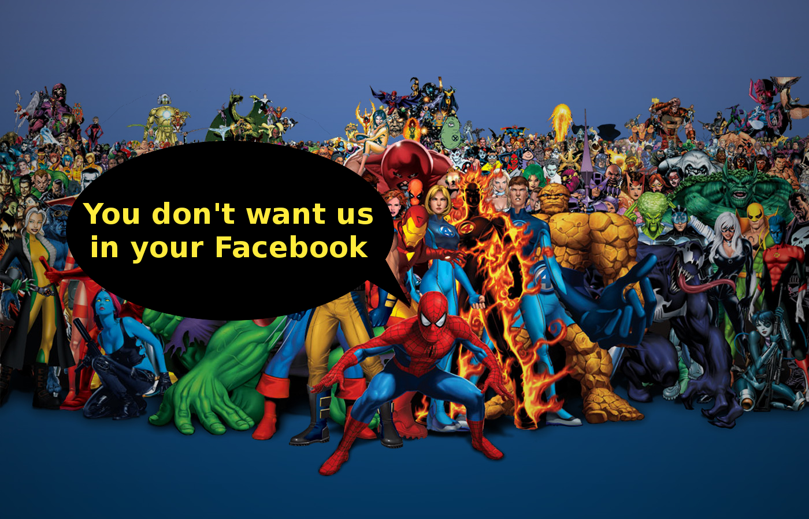

# Marvel-DC Blocker
Chrome Extension that removes all Facebook posts that mention any shit from Marvel or DC universe. 

For unknown reasons (during my childhood and probably related to my parents), I don't like anything related to super heroes. I know that most of you like movies and comics about heroes from Marvel and DC - and I respect it, but I personally don't like it. I mean, I really don't like it. It make me feel angry. Very. Angry.

Summarizing, I don't want to see anything related to "Civil War", "#TeamIronMan", "#TeamCap" or any shitty post from Marvel / DC universe in my Facebook. If you neither, then download this extension and be happy :)

Heavily based on [this Chrome extension](https://github.com/derekstory/remove_donald_trump_chrome_extension).

# License
Licensed under WTFPL.

  DO WHAT THE FUCK YOU WANT TO PUBLIC LICENSE 
                    Version 2, December 2004 

 Copyright (C) 2016 Fernando Paladini <fernandopalad@gmail.com>

 Everyone is permitted to copy and distribute verbatim or modified 
 copies of this license document, and changing it is allowed as long 
 as the name is changed. 

            DO WHAT THE FUCK YOU WANT TO PUBLIC LICENSE 
   TERMS AND CONDITIONS FOR COPYING, DISTRIBUTION AND MODIFICATION 

  0. You just DO WHAT THE FUCK YOU WANT TO.

# About
Created by Fernando Paladini. Licensed under 
